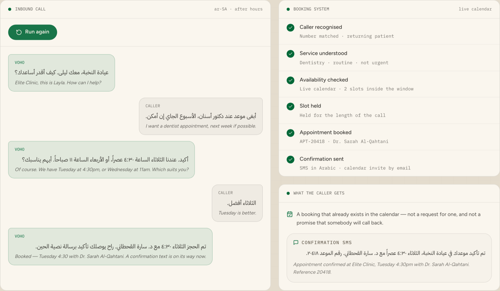

# AI Voice Agent for Saudi Businesses — Najdi

> A phone agent that answers in Saudi Arabic, checks what is actually free, and books the appointment before the caller hangs up.

Built for Saudi Arabia. The agent speaks **Najdi Arabic** — the dialect of
Riyadh and central Saudi Arabia — and is written for the businesses that live
on their phone line: clinics, salons, workshops, anywhere a missed call is a
lost booking.

<p align="center">
  <a href="https://voho.ai/demos/appointment-booking">
    
  </a>
</p>

<p align="center">
  <b><a href="https://voho.ai/demos/appointment-booking">▶ Play the live demo</a></b> — runs in your browser, no sign-up.
</p>

---

## What this does

- Answers an inbound call in Najdi Arabic and works out what the caller wants.
- Reads **real availability** out of a calendar, offers slots on different days, and holds one while the caller decides.
- Books it, returns the reference number spoken digit by digit, and sends an Arabic confirmation SMS.
- Handles the awkward cases: the caller who does not say which slot, and the slot taken by someone else mid-call.

## What speaks, and what listens

Voho is a speech **synthesis** API. It speaks; it does not transcribe. So this
repository is honest about the split:

| Part | What does it | Where |
| --- | --- | --- |
| Speaking | **Voho** — `sada-1`, voice `layla`, 8 kHz mulaw straight onto the phone line | [`voho.py`](voho.py) |
| Listening | Whatever you plug in — Twilio's own transcription, Whisper, or an on-premise recogniser | [`stt.py`](stt.py) |
| Deciding | An explicit state machine, not a model | [`agent.py`](agent.py) |
| Booking | SQLite here; swap it for your real calendar | [`booking.py`](booking.py) |

The deciding is deliberately not left to a model. The set of things a caller
can want when booking is small, and the cost of an appointment that a model
imagined into existence is high — so a model can be used to *understand* the
request, but never to decide that a slot exists.

## Quick start

You need a Voho API key. Create one at [app.voho.ai](https://app.voho.ai) under
**API Tokens**.

```bash
git clone https://github.com/yar-malik/ai-voice-agent-saudi-najdi.git
cd ai-voice-agent-saudi-najdi
pip install -r requirements.txt
cp .env.example .env      # then paste your key into .env
```

### Hear it without a phone number

```bash
python examples/cli.py
```

Type what a caller would say, in Arabic. Each reply is synthesised with Voho
and written to `out/`, so you can listen to exactly what the caller would have
heard. Press Enter on an empty line to run the built-in script instead:

```
  Voho  عيادة النخبة، معك ليلى. كيف أقدر أساعدك؟
Caller  أبغى موعد عند دكتور أسنان الأسبوع الجاي
  Voho  عندنا السبت الساعة 9 صباحاً، أو الأحد الساعة 9 صباحاً. أيهم يناسبك؟
Caller  تمام، خلها الموعد الأول
  Voho  تم الحجز السبت الساعة 9 صباحاً مع د. سارة القحطاني. رقم الموعد 2 0 0 0 1.
```

Add `--silent` to skip synthesis and read the conversation only — useful before
you have a key.

### Put it on a real number

```bash
export PUBLIC_URL=https://your-tunnel.ngrok.io
python app.py
```

Point a Twilio number's **Voice** webhook at `POST /voice`. That is the whole
integration: Twilio calls the app once per turn, the app hands back TwiML with
a URL to play, and the audio is synthesised on demand.

## Voices

| Voice | Dialect | Use it for |
| --- | --- | --- |
| `layla` | **Najdi**, female | Reception and appointment setting. The default here. |
| `nouf` | **Najdi**, female | Measured and senior — reminders, escalations. |
| `faisal` | **Najdi**, male | Even and authoritative. Reads long text well. |
| `omar` | **Najdi**, male | Bright and quick. Confirmations and outbound. |
| `yousef` | Modern Standard, male | Safest when the caller's dialect is unknown. |

Set `VOHO_VOICE` in `.env`, or list them live:

```bash
curl "https://app.voho.ai/v1/voices?dialect=najdi" \
  -H "Authorization: Bearer $VOHO_API_KEY"
```

## Reading numbers out loud

`APT-20418` and `٤:٣٠` are exactly where a synthesiser guesses wrong. Two
things in this repository deal with it: reference numbers are spoken digit by
digit before they are sent to Voho, and [`voho.normalize()`](voho.py) will
expand numbers, dates and abbreviations the way they are actually said.

## Running inside your own network

Saudi enterprises frequently require that call audio does not leave the
building. Point `VOHO_BASE_URL` at your own deployment and set
`STT_PROVIDER=custom` with `STT_URL` pointing at a self-hosted recogniser —
nothing else in the code changes.

## Security

- No key is committed. `.env` is git-ignored; `.env.example` holds placeholders only.
- Synthesised clips are held in memory against a random id and dropped after they are played once.
- Rotate keys from the dashboard, and scope one key per environment.

## More Voho examples

| Repository | What it covers | Live demo |
| --- | --- | --- |
| [ai-voice-agent-saudi-najdi](https://github.com/yar-malik/ai-voice-agent-saudi-najdi) | Booking appointments by phone | [Play it](https://voho.ai/demos/appointment-booking) |
| [realtime-arabic-voice-agent-najdi](https://github.com/yar-malik/realtime-arabic-voice-agent-najdi) | Streaming answers from your own documents | [Play it](https://voho.ai/demos/realtime-arabic-rag) |
| [charco-voice-agent-najdi](https://github.com/yar-malik/charco-voice-agent-najdi) | Taking restaurant orders by phone | [Play it](https://voho.ai/demos/restaurant-ordering) |
| [saudi-arabic-voice-agent](https://github.com/yar-malik/saudi-arabic-voice-agent) | Phone agents in Najdi Arabic | [Play it](https://voho.ai/demos/contact-center-ai) |
| [arabic-document-ai](https://github.com/yar-malik/arabic-document-ai) | Reading Saudi invoices, IDs and contracts | [Play it](https://voho.ai/demos/document-ai) |

## Want this in production?

We build the first workflow with you, on your own systems — usually live
within a month.

**[Book a call →](https://voho.ai/book-demo)**

---

MIT licensed. Built by [Voho](https://voho.ai) — enterprise AI for Saudi Arabia.
